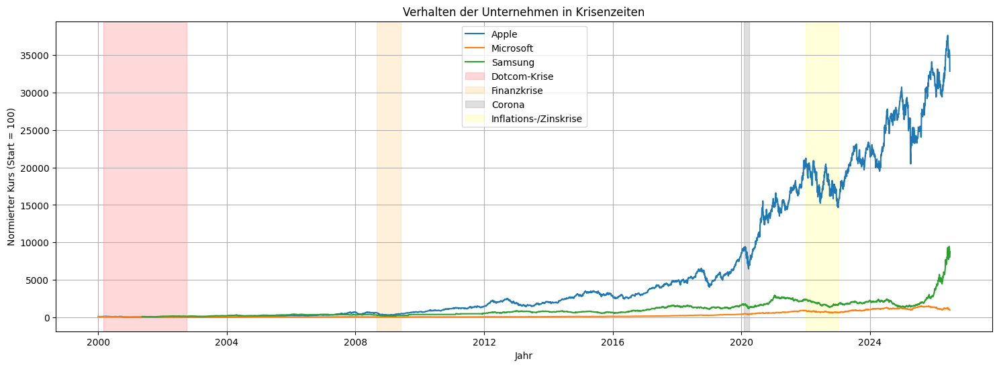
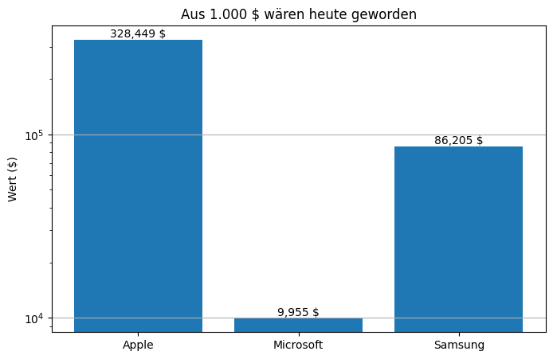
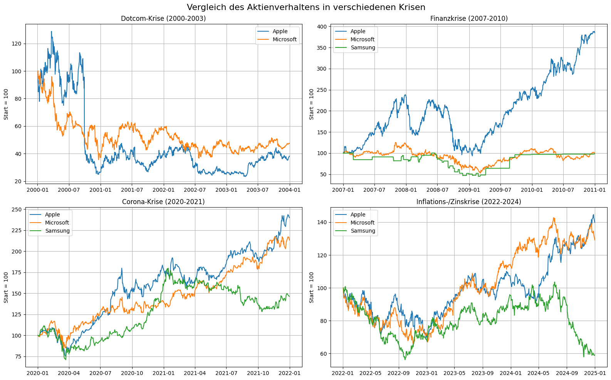

# Unternehmensanalyse anhand des Aktienkurses

Data-Science-Projekt (DSCB230, SoSe 2026, Gruppe Foxtrot) zum Vergleich von
Unternehmen auf Basis ihres Aktienkurses. Untersucht werden **Apple (AAPL)**,
**Microsoft (MSFT)** und **Samsung (SMSN.IL)** im Zeitraum ab 2000, ergänzt um ein
kurzfristiges Fallbeispiel zu **Intel (INTC)**. Alle Kurse werden in US-Dollar (USD)
betrachtet. Die Daten werden bei jeder Ausführung live über die Yahoo-Finance-API geladen.

## Features
- **Datenbeschaffung** live über Yahoo Finance (`yfinance`), automatisch aktuell bis heute
- **Datenbereinigung**: Prüfung auf fehlende Werte und Duplikate, Umrechnung der
  Samsung-GDR in Einzelaktien (1 GDR = 25 Stammaktien)
- **Ausreißeranalyse** der Tagesrenditen (Boxplot + IQR-Methode)
- **Kursvergleich**: statisch (Matplotlib)
- **Rendite** als gleitender Jahresdurchschnitt der Tagesrenditen
- **Volatilität** als gleitende 30-Tage-Standardabweichung
- **Gleitende Durchschnitte**: SMA 50/200 und EMA 50/200
- **Krisenanalyse**: normierter Kursvergleich mit markierten Krisenphasen, Subplots je
  Krise und Kennzahlentabelle (max. Verlust, Gesamtrendite)
- **Investitionsbeispiele**: Entwicklung von 1.000 USD seit 2000 (alle drei Unternehmen)
  sowie ein kurzfristiges Intel-Fallbeispiel seit dem 04.05.2026
- **Fazit** mit Investitionsschlussfolgerung und **Lessons Learned**

## Technologien
- Python
- Jupyter Notebook
- [yfinance](https://pypi.org/project/yfinance/) (Datenquelle: Yahoo Finance)
- pandas
- Matplotlib

## Projekt ausführen
1. Repository klonen:
   ```bash
   git clone <repo-url>
   cd DSCB230_SoSe26_Hausarbeit_Foxtrot
   ```
2. (Empfohlen) virtuelle Umgebung anlegen und aktivieren:
   ```bash
   python3 -m venv .venv
   source .venv/bin/activate
   ```
3. Abhängigkeiten installieren:
   ```bash
   pip install -r requirements.txt
   ```
4. Notebook `DSCB230_SoSe26_Hausarbeit_Foxtrot.ipynb` in VS Code öffnen und
   alle Zellen ausführen (*Run All*). Eine bestehende Internetverbindung ist nötig, da die
   Kursdaten zur Laufzeit geladen werden.

## Vorschau

> **Hinweis:** Beispielausführung — da die Kursdaten live über Yahoo Finance geladen werden,
> ändern sich die Werte bei jedem Lauf.

**Normierter Kursvergleich (Start = 100) mit markierten Krisenphasen**



**Wertentwicklung einer Investition von 1.000 USD seit 2000 (logarithmische Skala)**



**Verhalten in den einzelnen Krisen (je Krisenfenster normiert)**



Alle weiteren Visualisierungen (Kursverlauf, Rendite, Volatilität, gleitende Durchschnitte,
Ausreißer-Boxplot, Intel-Fallbeispiel) befinden sich als ausgeführte Zellen im Notebook.
